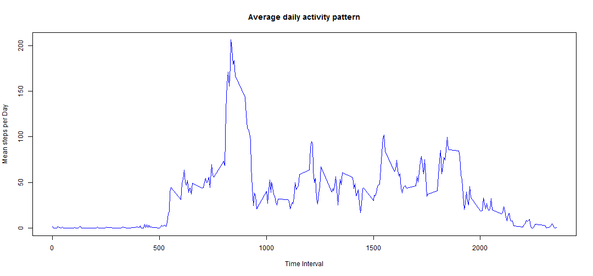
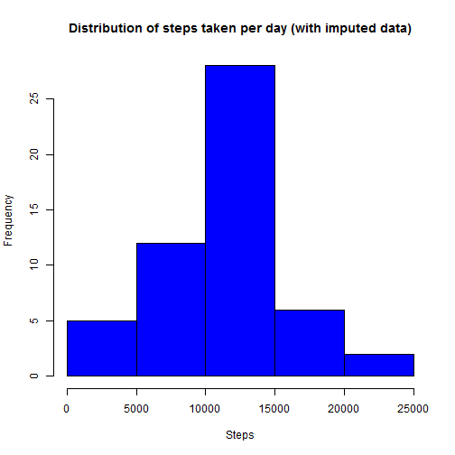
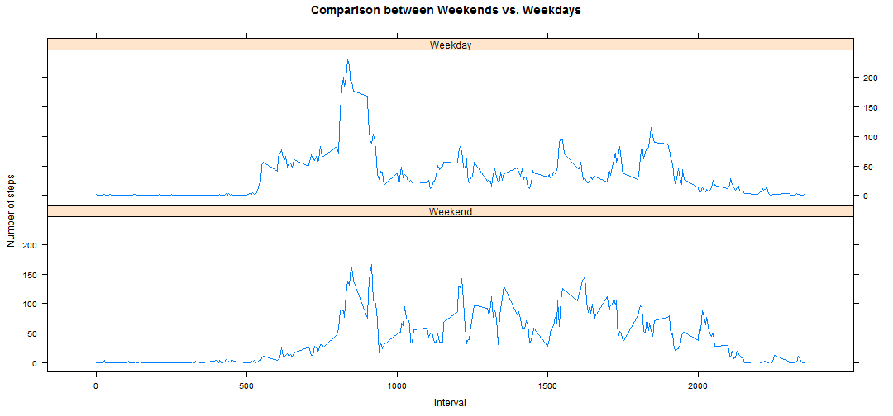

# Reproducible Research - Peer Assessment 1
Akshat Narain

## Loading and preprocessing the data

Here I load the activity data and show summary statistics as well as first few rows of the data.
While loading the data it is assumed that you have downloaded and saved the data in your 'R working directory' with the name "activity.csv"


```r
actdata <- read.csv("activity.csv", header=TRUE)
head(actdata, n=3)
```

```
##   steps       date interval
## 1    NA 2012-10-01        0
## 2    NA 2012-10-01        5
## 3    NA 2012-10-01       10
```

```r
summary(actdata)
```

```
##      steps               date          interval   
##  Min.   :  0.0   2012-10-01:  288   Min.   :   0  
##  1st Qu.:  0.0   2012-10-02:  288   1st Qu.: 589  
##  Median :  0.0   2012-10-03:  288   Median :1178  
##  Mean   : 37.4   2012-10-04:  288   Mean   :1178  
##  3rd Qu.: 12.0   2012-10-05:  288   3rd Qu.:1766  
##  Max.   :806.0   2012-10-06:  288   Max.   :2355  
##  NA's   :2304    (Other)   :15840
```

```r
options("scipen" = 10)
```

## Mean total number of steps per day

The data is aggregated to show sum of steps taken each day.
A histogram is created to study distribution of sum of steps taken per day followed by mean and meadian of the data.


```r
stepsperday <- aggregate(.~date, data=actdata, FUN=sum)
hist(stepsperday$steps, main="Distribution of steps taken per day", xlab="Steps", col="blue")
```

 

```r
mean <- mean(stepsperday$steps)
median <- median(stepsperday$steps)
```

The mean of steps taken per day is **10766.1887**.

The median of steps taken per day is **10765**.

## Average daily activity pattern

Next we move to see daily activity pattern. The data is summarised at a 5 minute interval level for mean steps taken across all days followed by a plot to show the trend.


```r
actdata$int <- factor(actdata$interval)
daymean <- tapply(actdata$steps, actdata$int, mean, na.rm=TRUE)
timeint <- unique(actdata$interval)
plotdata <- data.frame(timeint, daymean)
plot(plotdata, type="l", col="blue", main="Average daily activity pattern", 
xlab="Time Interval", ylab="Mean steps per Day")
```

 

```r
maxval <- max(daymean)
maxint <- plotdata[plotdata$daymean==maxval,]
maxintval <- maxint$timeint
```
The maximum number of mean steps is equal to **206.1698** and it occurs at **835th interval**.


## Imputing missing values

There are a number of missing values in the data. Till now we have ignored them. Let's see how many missing values are there in the data.


```r
rows <- nrow(actdata)
counter <- 0
for (i in 1:rows) {
if(is.na(actdata$steps[i])) {
counter = counter + 1
} }
```

The number of missing values in the data is **2304**.

I will now replace the missing values with **average steps** taken for that interval across all days using the following code.


```r
for (i in 1:rows) {
	if (is.na(actdata$steps[i])){
		int <- actdata$interval[i]
		val <- plotdata[plotdata$timeint==int,]
		value <- val$daymean
		actdata$newsteps[i] <-  value
		}
	else {
		actdata$newsteps[i] <- actdata$steps[i]
		}
}
newstepsperday <- aggregate(.~date, data=actdata, FUN=sum)
hist(newstepsperday$newsteps, main="Distribution of steps taken per day (with imputed data)", 
xlab="Steps", col="blue")
```

 

```r
newmean <- mean(newstepsperday$newsteps)
newmedian <- median(newstepsperday$newsteps)
```
The mean of steps taken per day is **10766.1887**.

The median of steps taken per day is **10765**.

The mean and median steps taken per day calculated from the new data does not change.

## Differences in activity patterns between weekdays and weekends

Now we check if there is a difference in activity when comparing weekdays to weekends. Please install **lattice** package before running this code.


```r
library(lattice)
actdata$newdate <- strptime(as.character(actdata$date), "%Y-%m-%d")
actdata$weekday <- weekdays(actdata$newdate)
actdata$week <- ifelse(actdata$weekday=="Saturday" | actdata$weekday=="Sunday", 1, 2)
actdata$weekend <- factor(actdata$week, labels=c("Weekend", "Weekday"))
plotdata2 <- aggregate(newsteps ~ int + weekend, data = actdata, FUN="mean")
plotdata2$int <- as.numeric(as.character(plotdata2$int))
xyplot(newsteps ~ int | weekend, data=plotdata2, type="l", layout=c(1,2), 
xlab="Interval", ylab="Number of steps", main="Comparison between Weekends vs. Weekdays")
```

 
